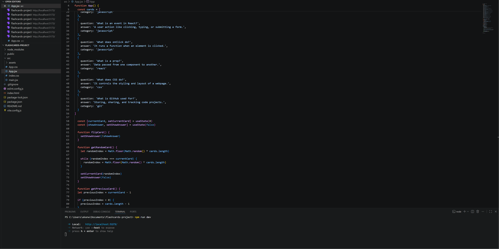

# Web Development Project 2 - *Web Dev Flashcards*

Submitted by: **Joseph Ghormley**

This web app: **A React flashcard study app that helps users review web development basics such as React, JavaScript, CSS, GitHub, state, props, and events. Users can click a card to flip between the question and answer, then use the arrow buttons to move through the deck.**

Time spent: **4** hours spent in total

## Required Features

The following **required** functionality is completed:

- [x] **The app displays the title of the card set, a short description, and the total number of cards**
  - [x] Title of card set is displayed
  - [x] A short description of the card set is displayed
  - [x] A list of card pairs is created
  - [x] The total number of cards in the set is displayed
  - [x] Card set is represented as a list of card pairs
- [x] **A single card at a time is displayed**
  - [x] Only one half of the information pair is displayed at a time
- [x] **Clicking on the card flips the card over, showing the corresponding component of the information pair**
  - [x] Clicking on a card flips it over, showing the back with corresponding information
  - [x] Clicking on a flipped card again flips it back, showing the front
- [x] **Clicking on the next button displays a random new card**

The following **optional** features are implemented:

- [ ] Cards contain images in addition to or in place of text
  - [ ] Some or all cards have images in place of or in addition to text
- [x] Cards have different visual styles such as color based on their category
  - [x] Cards are styled by category, such as React, JavaScript, CSS, and Git

The following **additional** features are implemented:

* [x] Added left and right arrow buttons for navigation
* [x] Added a web-development themed background
* [x] Added a header panel to make the title and description easier to read
* [x] Added category-based card colors for better visual organization

## Video Walkthrough

Here's a walkthrough of implemented required features:

GIF created with **ScreenToGif**

## Notes

One challenge I encountered was understanding how to use React state to keep track of which card was currently displayed and whether the card was showing the question or the answer. I also had to make sure the next button showed a random card instead of moving through the cards in a regular order. Another challenge was styling the page so the title, card, and buttons were easy to read against the background.

## Resources

- [Vite Guide](https://vite.dev/guide/)
- [React useState Hook](https://react.dev/reference/react/useState)
- [React: Responding to Events](https://react.dev/learn/responding-to-events)
- [React: Passing Data Through Props](https://react.dev/learn/tutorial-tic-tac-toe#passing-data-through-props)
- [React School: Button UI](https://react.school/ui/button)
- CodePath WEB102 Unit 2 PowerPoint: Building an Interactive Frontend

## License

    Copyright 2026 Joseph Ghormley

    Licensed under the Apache License, Version 2.0 (the "License");
    you may not use this file except in compliance with the License.
    You may obtain a copy of the License at

        http://www.apache.org/licenses/LICENSE-2.0

    Unless required by applicable law or agreed to in writing, software
    distributed under the License is distributed on an "AS IS" BASIS,
    WITHOUT WARRANTIES OR CONDITIONS OF ANY KIND, either express or implied.
    See the License for the specific language governing permissions and
    limitations under the License.
